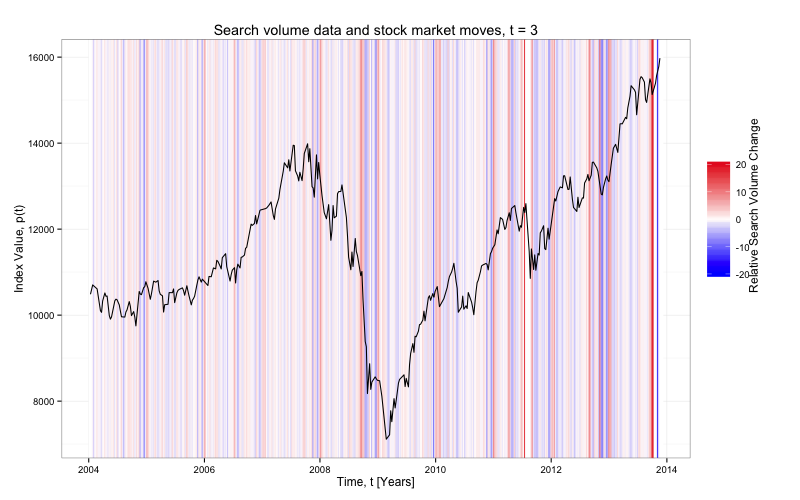
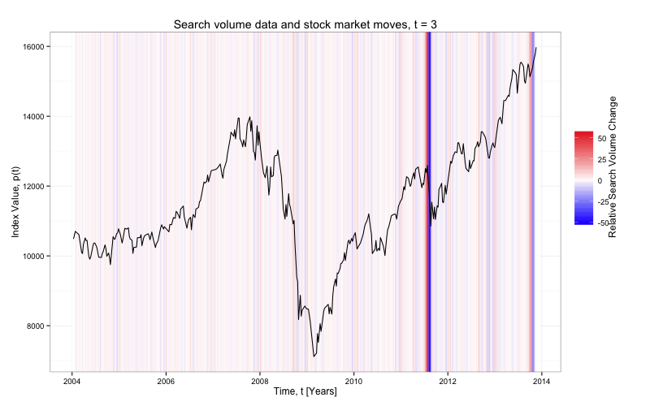
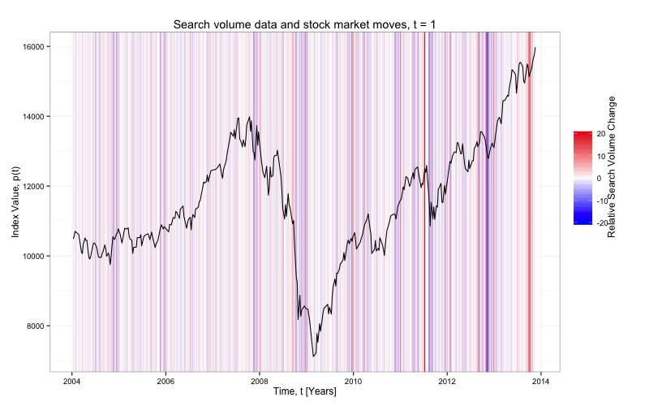
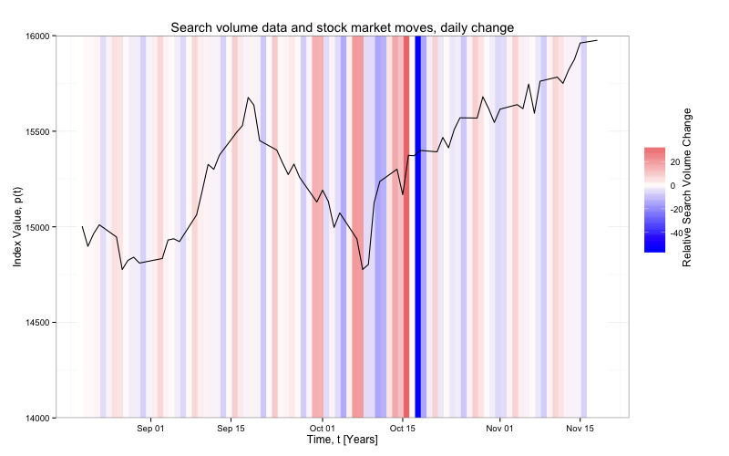

Thomson_Reuters_Viz
===================
___

Replicated visualizations from my time at Thomson Reuters. Original plot can be found at: <http://www.nature.com/srep/2013/130425/srep01684/full/srep01684.html>

### Plots and Descriptions
 

  **Figure 1** 

 This plot shows relative change in U.S. Google Trend search volume for 'debt' over a three-week period and the corresponding Dow Jones Industrial Average. The extreme values are removed to make the changes in debt search volume more clear.  

 __Figure 2__ 

  This plot is the same as Figure 1, but contains the extreme values. 

 **Figure 3** 

 Rather than use a three week time window like the above plots, we toggled the window to two weeks. 

 **Figure 4**

 Again, a change in time window -- this time to one week. 

 **Figure 5**

This plot shows the relative change at a daily level. There is a clear weekly pattern in the relative changes in search volume. 
