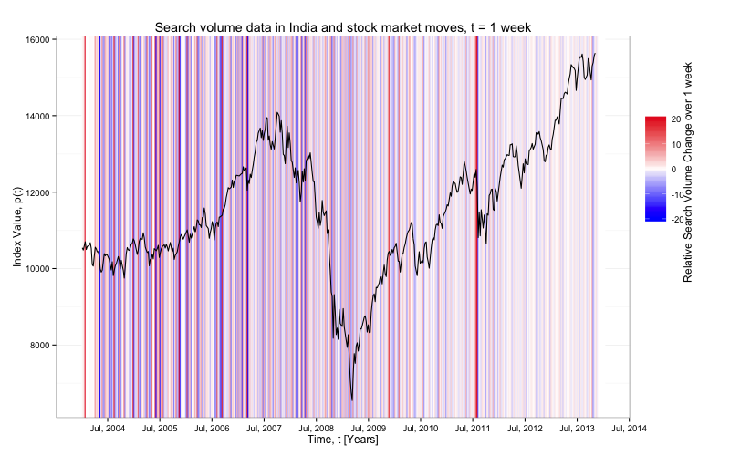
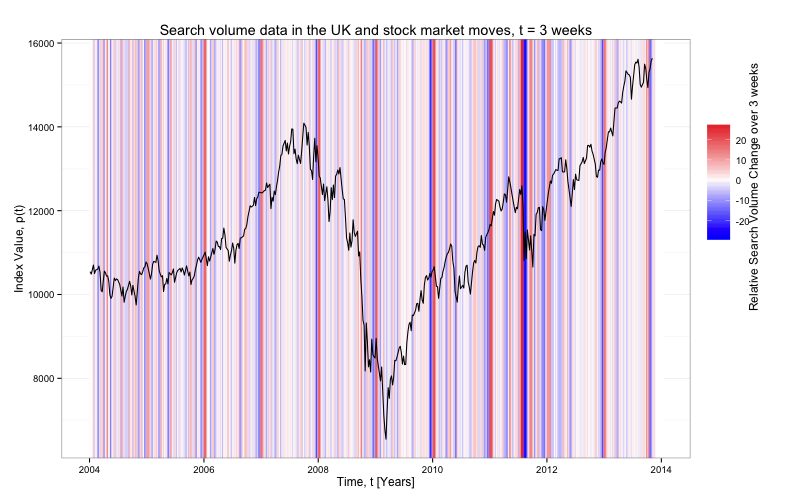

Thomson Reuters Viz
===================
___

Replicated visualizations from my time at Thomson Reuters. Original plot can be found at: <http://www.nature.com/srep/2013/130425/srep01684/full/srep01684.html>

### Plots and Descriptions
 

 <b>Figure 1</b>

 This plot shows relative change in U.S. Google Trend search volume for 'debt' over a three-week period and the corresponding Dow Jones Industrial Average. The extreme values are removed to make the changes in debt search volume more clear.  

 <b>Figure 2</b>

  This plot is the same as Figure 1, but contains the extreme values. 

 <b> Figure 3 </b>

 Rather than use a three week time window like the above plots, we toggled the window to two weeks. 

 <b> Figure 4 </b> 

 Again, a change in time window -- this time to one week. 

 <b> Figure 5 </b> 

This plot shows the relative change at a daily level. There is a clear weekly pattern in the relative changes in search volume.

 <b> Figure 6 </b> 

To visually check if there was a 'holiday' effect in the search volume for debt, we replicated the graphic for a non-Christian country. This graph shows relative change in India Google Trend search volume for debt over a three-week period and the corresponding Dow Jones Industrial Average.

 <b> Figure 7 </b> 

This graph shows relative change in UK Google Trend search volume for debt over a three-week period and the corresponding Dow Jones Industrial Average. 

